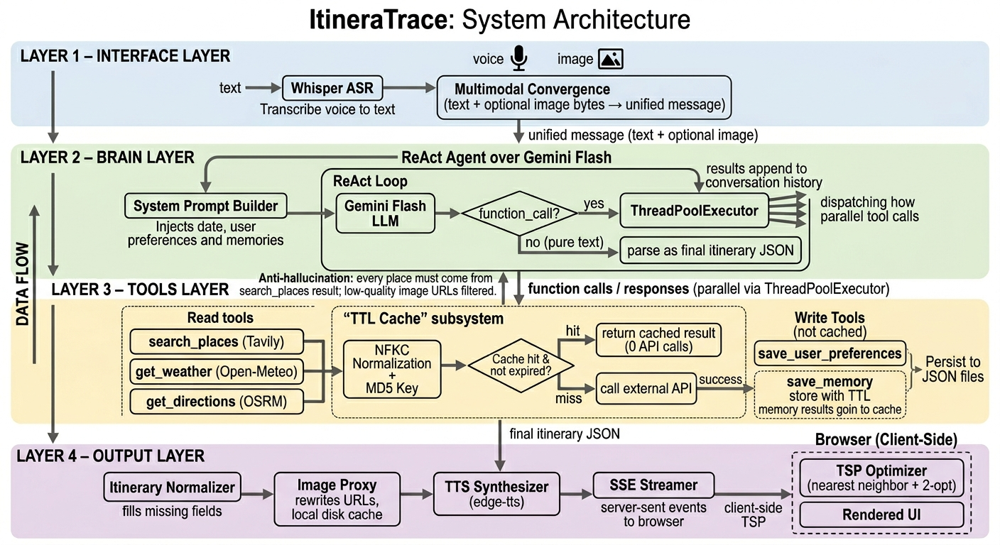

<p align="center">
  
</p>

<p align="center">
  <strong>Trace the Thinking. Shape the Journey.</strong><br>
  A multimodal AI travel planning agent with voice, vision, and memory.
</p>

<p align="center">
  
  
  
  
  
</p>

---

## Overview

**ItineraTrace** is an agentic AI travel planner that goes beyond simple chatbot Q&A. It autonomously searches for **real places**, checks **live weather**, computes **walking routes**, and assembles a structured day-by-day itinerary — all through an iterative ReAct reasoning loop.

It accepts **voice**, **text**, and **image** input, responds with **speech** and a rich **visual itinerary**, and **remembers** your preferences across trips.

Built as a solo final project for **CSCI3280 — Introduction to Multimedia**.

---

## Features

### Multimodal Input & Output

| Input | Output |
|-------|--------|
| Text chat | Structured itinerary with photos |
| Voice recording (Whisper STT) | Text-to-speech narration (Edge-TTS) |
| Image upload / paste (landmark recognition) | Real-time progress streaming (SSE) |

### Agentic Planning (ReAct Loop)

- Gemini LLM reasons step-by-step, calling tools iteratively 
- **Zero hallucination** — every place comes from a live Tavily web search
- **Weather-aware** — fetches 16-day forecasts; suggests indoor venues on rainy days
- **Realistic routing** — computes walking distances between stops via OSRM
- Structured JSON itinerary with times, durations, transport, and photos

### Dynamic Memory

- The agent **learns naturally** from conversation ("I'm vegetarian", "traveling with kids")
- Memories persist across trips and are injected into the system prompt
- View, add, and delete memories from the sidebar panel
- No forms — preferences are captured through natural dialogue

### Image Recognition

- Upload or paste a photo of any landmark
- Gemini Vision identifies the location and plans a trip around it
- Supports JPEG, PNG, GIF, and WebP

### Multi-Trip Management

- Create and switch between multiple trips in a single session
- Each trip preserves its own chat history and itinerary
- Multiple itineraries per trip (ask for a second destination mid-chat)

### Polished UI

- Dark / light theme toggle (persisted in localStorage)
- Smart suggestion chips that adapt to conversation context
- Inline forms for destination, dates, pace, and interests
- Responsive layout with mobile bottom navigation
- Floating stop button for TTS playback

---

## Architecture

<p align="center">
  
</p>

The system is organized into five layers:

1. **Multimodal User Interface** — accepts voice (microphone), text (keyboard), and image (camera/upload) input
2. **Input Processing Module** — Whisper STT transcribes audio (`/transcribe`); image handler stores uploads (`/upload-image`)
3. **Core Agent Intelligence Layer** — Gemini 3.1 Flash Lite drives a ReAct loop (up to 15 iterations) that reasons, calls tools, and observes results; a memory manager persists user preferences across trips
4. **Knowledge Augmentation & Tool Network** — external APIs provide real data: Tavily (`search_places`), Open-Meteo (`get_weather`), OSRM (`get_directions`)
5. **Multimodal Response Generation & Rendering** — TTS engine narrates a summary; timeline UI renderer converts JSON into visual itinerary components; delivered to the browser via FastAPI + SSE

---

## Tech Stack

| Component | Technology | Cost |
|-----------|-----------|------|
| **LLM** | Gemini 3.1 Flash Lite Preview | Free tier |
| **STT** | OpenAI Whisper (base, local) | Free |
| **TTS** | Edge-TTS | Free |
| **Places** | Tavily API (with images) | Free tier (1k req/mo) |
| **Weather** | Open-Meteo | Free |
| **Routing** | OSRM + Nominatim | Free |
| **Backend** | FastAPI + Uvicorn | — |
| **Frontend** | Vanilla HTML / CSS / JS | — |

---

## Getting Started

### Prerequisites

- Python 3.10+
- A [Gemini API key](https://aistudio.google.com/) (free Flash Lite tier)
- A [Tavily API key](https://tavily.com/) (free tier)

### Install

```bash
pip install -r requirements.txt
```

### Configure

Create a `.env` file in the project root:

```env
GOOGLE_API_KEY=your_gemini_key
TAVILY_API_KEY=your_tavily_key
```

Weather (Open-Meteo) and routing (OSRM/Nominatim) require no API keys.

### Run

```bash
python app.py
```

Open **http://localhost:8000**.

---

## Project Structure

```
travel-agent/
├── agent.py            # ReAct loop, system prompt, tool dispatch, multimodal input
├── app.py              # FastAPI endpoints, SSE streaming, session management
├── config.py           # Environment variable loading
├── renderer.py         # JSON normalizer (safe defaults, image passthrough)
├── stt.py              # Whisper STT wrapper (lazy-loaded)
├── tts.py              # Edge-TTS async synthesis
├── user_memory.py      # Freeform memory persistence (save / load / delete)
├── tools/
│   ├── __init__.py     # TOOL_REGISTRY
│   ├── places.py       # Tavily search with image URLs
│   ├── weather.py      # Open-Meteo forecast + planning hints
│   └── routes.py       # OSRM routing + Nominatim geocoding
├── static/
│   ├── index.html      # Single-page UI (sidebar + chat + itinerary)
│   ├── style.css       # Dark/light theme, timeline, responsive layout
│   ├── app.js          # Voice, image upload, memory panel, rendering
│   ├── audio/          # TTS output (auto-cleaned)
│   └── uploads/        # Temp image uploads (auto-cleaned)
├── assets/
│   └── cover.png       # README cover image
└── requirements.txt
```

---

## API Endpoints

| Method | Endpoint | Description |
|--------|----------|-------------|
| `POST` | `/chat` | Main agent chat (SSE streaming) |
| `POST` | `/transcribe` | Audio → text via Whisper |
| `POST` | `/upload-image` | Upload image for recognition |
| `GET` | `/memories` | List all saved memories |
| `POST` | `/memories` | Add a memory manually |
| `DELETE` | `/memories/{id}` | Delete a memory |
| `DELETE` | `/session/{id}` | Clear conversation history |

---

## How It Works

1. **Input** — User types, speaks, or uploads an image
2. **STT** — Whisper transcribes audio in a background thread
3. **Vision** — If an image is attached, Gemini identifies the landmark
4. **Agent loop** — Gemini iterates through tool calls:
   - `search_places` for attractions, restaurants, cafes
   - `get_weather` for the travel dates
   - `get_batch_directions` for all route legs
   - `save_memory` when user reveals preferences
5. **Itinerary** — Agent emits structured JSON with times, photos, transport
6. **Rendering** — Frontend renders a visual timeline with activity cards
7. **TTS** — Edge-TTS narrates a human-friendly summary
8. **Response** — Browser receives text, itinerary data, and audio via SSE

---

## Limitations

- Whisper `base` may struggle with heavy accents or noisy environments
- Tavily image URLs are third-party and may occasionally break (hidden via `onerror`)
- OSRM routing has limited coverage in very rural areas
- Gemini Flash Lite free tier: 500 requests/day
- Very obscure landmarks may not be recognized by Gemini Vision

---

## License

Academic project — CSCI3280 Introduction to Multimedia, CUHK.
